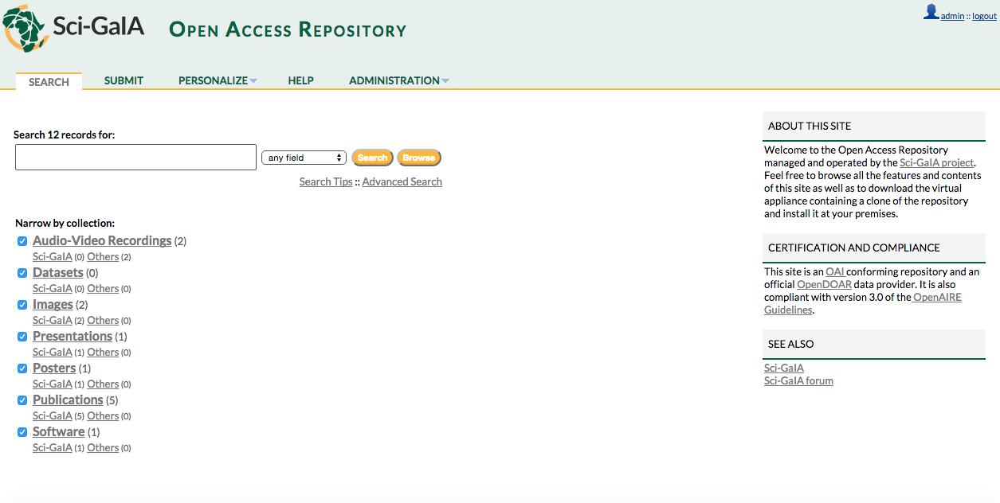

============
Introduction
============

sidebar:: Version Available 1.0
    :subtitle: OAR runs on

    - SO Ubuntu 14.04.3 LTS
    - Python 2.7.6
    - Mysql Ver 14.14 Distrib 5.5.44
    - Invenio 1.2.1

The virtual appliance contains a clone of Sci-GaIA Open Access Repositories `Sci-GaIA OAR <http://oar.sci-gaia.eu/>`_, if you'd like to install your own open access repository based on standard technologies, you can simply `download <http://oar-sci-gaia.readthedocs.org/en/latest/virtual-machine.html>`_this clone and deploy it on your virtualization environment.

 
 

