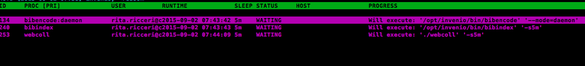

=================
OAR Configuration
=================

.. seealso::

	About `Invenio <http://invenio-software.org/>`_

        Invenio `Documentation <http://invenio-software.org/wiki/General/Documentation>`_

        Admin `HOWTO guides <http://invenio-demo.cern.ch/help/admin/>`_

.. hlist::
        :columns: 1      

	* About `Invenio <http://invenio-software.org/>`_ 

	* Invenio `Documentation <http://invenio-software.org/wiki/General/Documentation>`_ 

	* Admin `HOWTO guides <http://invenio-demo.cern.ch/help/admin/>`_ 

**Getting Started**

1) If running you "Stop" bibsched queue so that no jobs are running during migration.

::

	cd /opt/invenio/bin/
        sudo -u www-data ./bibsched
        press "A"

2) Edit your **invenio-local.conf**

::

	
	$ sudo -u www-data vim /opt/invenio/etc/invenio-local.conf # edit as follows

and put wanted values there:

*Site URL*

::

	CFG_SITE_URL = http://yoursite.org
        CFG_SITE_SECURE_URL = https://yoursite.org

*Site Name*

::

	## CFG_SITE_NAME -- the visible name of your Invenio installation.
	CFG_SITE_NAME = Institute

	## CFG_SITE_NAME_INTL -- the international versions of CFG_SITE_NAME
	## in various languages.  (See also CFG_SITE_LANGS below.)
	CFG_SITE_NAME_INTL_en =  Institute
	CFG_SITE_NAME_INTL_fr = Institut

*SuperUser and Email Address*

::

	# CFG_SITE_SUPPORT_EMAIL -- the email address of the support team for
	# this installation:
	
	CFG_SITE_SUPPORT_EMAIL = admin@sci-gaia.eu

        # CFG_SITE_ADMIN_EMAIL -- the email address of the 'superuser' for
	# this installation.  Enter your email address below and login with
	# this address when using Invenio inistration modules.  You
	# will then be automatically recognized as superuser of the system.
	
	CFG_SITE_ADMIN_EMAIL =  admin@sci-gaia.eu

*Mail Server*

::

	# CFG_MISCUTIL_SMTP_HOST -- which server to use as outgoing mail server to
	# send outgoing emails generated by the system, for example concerning
	# submissions or email notification alerts.
	
	CFG_MISCUTIL_SMTP_HOST

3) Propagate these changes to all installed files:

::

	$ sudo -u www-data /opt/invenio/bin/inveniocfg --update-all

4) Update Apache configuration file, either by running:

::

	$ sudo -u www-data /opt/invenio/bin/inveniocfg --create-apache-conf

or by manually editing virtual host configuration files 

::

	sudo -u www-data vim /opt/invenio/etc/apache/invenio-apache-vhost*.conf.

5) You can restart your Apache server now:

::

	$ sudo /etc/init.d/apache2 restart

6) Remove help pages (user|admin|hacking) cache (please first ensure that you have not mistakenly edited these files to add custom information, instead of editing the source of the help pages):

::

	$ sudo -u www-data rm -r /opt/invenio/var/cache/webdoc/

(Cache will be automatically recreated based on the source file when one accesses a page. 
You can force the creation of these pages by accessing the table of content for each section: http://yoursite.eu/help/contents, http://yoursiste.eu/help/admin/contents and http://yoursite.eu/help/hacking/contents)

7) Put your bibsched queue back to automatic mode, and you are done.

::

	cd /opt/invenio/bin/
        sudo -u www-data ./bibsched
        press "A"
