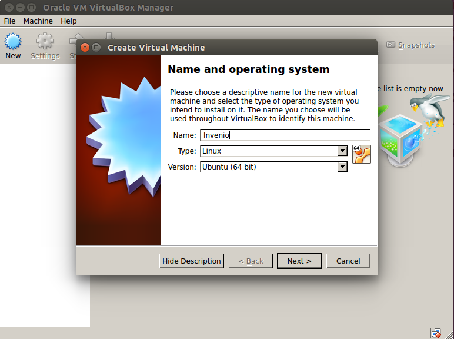
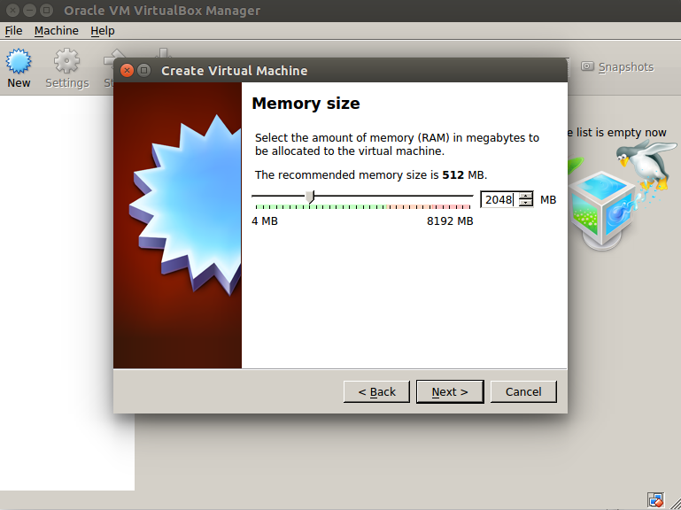
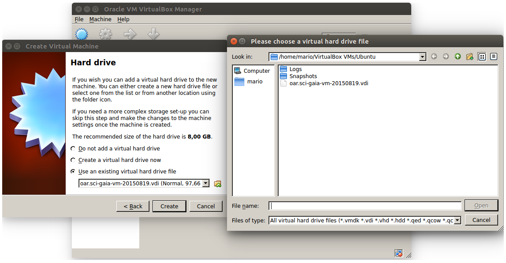
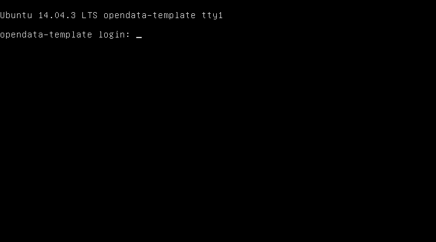
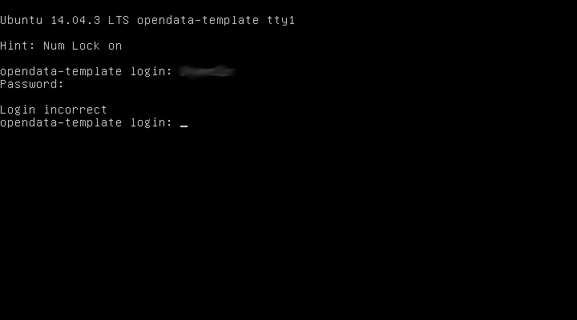

===============
Virtual Machine
===============

.. .. contents:: :depth: 2

-----
About
-----

.. sidebar:: Version Available 1.0
    :subtitle: OAR runs on

    - SO Ubuntu 14.04.3 LTS
    - Python 2.7.6
    - Mysql Ver 14.14 Distrib 5.5.44
    - Invenio 1.2.1


The virtual appliance contains a clone of Sci-GaIA Open Access Repositories `Sci-GaIA OAR <http://oar.sci-gaia.eu/>`_, if you'd like to install your own open access repository based on standard technologies, you can simply download this clone and deploy it on your virtualization environment.

--------------
Deploying OAR
--------------

To deploy your own open access repository, you can download the image from `here <http://oar.sci-gaia.eu/record/19/files/oar.sci-gaia-vm-20150819.qcow2>`_, the file size is about 10GB. In this way you download the Sci-GaIA Open Access Repository template that can be deployed on your virtualization environment. The image is in QCOW format, but can be easily converted in other format as you need, using **qemu** utils. 

.. In this guide we'll show you how to use it in a local Virtualbox environment

^^^^^^^^^^^^
First Access
^^^^^^^^^^^^

Before you can do the first access to your newly OAR installation, please `contact us <mailto: admin@sci-gaia.eu>`_ to get the default OAR template credentials. This template allows login only with keys and don't permit SSH root login, for security reasons.
Once you get default credentials, login into the OAR installation from the virtualization environment console and perform the the following steps.

.. warning:: If you don't do this you will get hacked.

1. Add your ssh public keys to the invenio user

.. note:: You can use your preferred way to do this stuff. For example , if you maintain your public keys with the github service you can do the following:

    - wget https://github.com/<github_username>.keys
    - mv <github_username>.keys .ssh/authorized_keys

2. Test remote login: 

.. code::
    
    ssh invenio@<oar_ip_address>
    Welcome to Ubuntu 14.04.3 LTS (GNU/Linux 3.13.0-62-generic x86_64)

     * Documentation:  https://help.ubuntu.com/

     System information disabled due to load higher than 1.0

     Get cloud support with Ubuntu Advantage Cloud Guest:
        http://www.ubuntu.com/business/services/cloud
        
3. Setup firewall according yoursecurity requirements, the default rules applied to the the template are the following:

.. code::

    sudo iptables -L -n
    Chain INPUT (policy DROP)
    target     prot opt source               destination         
    ACCEPT     all  --  0.0.0.0/0            0.0.0.0/0            state RELATED,ESTABLISHED
    DROP       tcp  --  0.0.0.0/0            0.0.0.0/0            tcp flags:0x3F/0x00
    DROP       tcp  --  0.0.0.0/0            0.0.0.0/0            tcp flags:!0x17/0x02 s...
    DROP       tcp  --  0.0.0.0/0            0.0.0.0/0            tcp flags:0x3F/0x3F
    ACCEPT     all  --  0.0.0.0/0            0.0.0.0/0           
    ACCEPT     tcp  --  0.0.0.0/0            0.0.0.0/0            tcp dpt:22
    ACCEPT     tcp  --  0.0.0.0/0            0.0.0.0/0            tcp dpt:80
    ACCEPT     tcp  --  0.0.0.0/0            0.0.0.0/0            tcp dpt:443
    REJECT     tcp  --  0.0.0.0/0            0.0.0.0/0            tcp flags:0x16/0x02 re...
    REJECT     all  --  0.0.0.0/0            0.0.0.0/0            reject-with icmp-host-...

    Chain FORWARD (policy ACCEPT)
    target     prot opt source               destination         

    Chain OUTPUT (policy ACCEPT)
    target     prot opt source               destination

-------------------
Deployment Examples
-------------------

^^^^^^^^^^^^^^^^^^^^
Openstack deployment
^^^^^^^^^^^^^^^^^^^^

.. _label-name

^^^^^^^^^^^^^^^^^^^^^
VirtualBox deployment
^^^^^^^^^^^^^^^^^^^^^

    .. warning:: This deployment example is provided just for test or demostrative purposes, don't use for production environment.
    
    .. note:: Sometimes you could experiment problems deploying OAR on Virtualbox using the provided QCOW image. In this case you can convert the disk format from qcow2 to vdi using qemu utils, as described in the troubleshooting section.

In order to deploy the image on Virtualbox you should:

1. create a new vitual machine (see Figure `1`_) specifing your machine name, OS type anchitecture, then click *Next* button;
2. specify the machine RAM size, use at least 2GB of RAM (see Figure `2`_), click *Next* button;
3. attach the downloaded image as disk (see Figure `3`_);
4. finally start the virtual machine. It may take some time before start, depends on your hardware.

.. _1:


   
   Create new Virtual Machine.
   
.. _2:


   
   Specifiy the RAM size.
   
.. _3:


   
   Attach oar image.

Once the virtual machine is up and running provide the default credentials to login into (see Figure `4`_).

.. _4:


   
   OAR template console.

The image is equiped with 20GB dinamically allocated disk, if you need more disk space you can perform the following commmands:

1. shtdown the Virtual machine;
2. from your guest system perform the **VBoxManage modifyhd** specifying the new Hard disk size in MB:

.. code:: 

    VBoxManage modifyhd /path/to/the/oar.sci-gaia-vm-20150819.vdi --resize <new_size(MB)>
    0%...10%...20%...30%...40%...50%...60%...70%...80%...90%...100%

3. restart the Virtual Machine, login into and check the disk size using: 

.. code::
    
    invenio@opendata-template:~$ df -Th
        
---------------
Troubleshooting
---------------

In this section there are some possible solutions to the problems you could face during the OAR template deployment.


^^^^^^^^^^^^^^^^^^^^^^^^^^^^^
Cannot access Virtual Machine 
^^^^^^^^^^^^^^^^^^^^^^^^^^^^^

**Problem**

Although you provide the right credentials you cannot access the Virtual Machine from console, see Figure ``:ref:`5```

.. _5:


   
   Error Accessing the Virtual Machine.

**Solution**

This problem is often related to the keyboard layout loaded, please check the special character typing them temporarly on the username to be sure that you are typing the right password.

^^^^^^^^^^^^^^
Disk extension 
^^^^^^^^^^^^^^

**Problem**

If you successfully excuted a disk extension, but when you check the size you still see the default size.

.. code::

 root@opendata-template:~# df -Th
 Filesystem     Type      Size  Used Avail Use% Mounted on
 /dev/sda1      ext4       20G  7.3G   12G  39% /
 none           tmpfs     4.0K     0  4.0K   0% /sys/fs/cgroup
 udev           devtmpfs  997M   12K  997M   1% /dev
 tmpfs          tmpfs     201M  376K  200M   1% /run
 none           tmpfs     5.0M     0  5.0M   0% /run/lock
 none           tmpfs    1001M     0 1001M   0% /run/shm
 none           tmpfs     100M     0  100M   0% /run/user
 
 root@opendata-template:~# fdisk -l

 Disk /dev/sda: 104.9 GB, 104857600000 bytes
 4 heads, 32 sectors/track, 1600000 cylinders, total 204800000 sectors
 Units = sectors of 1 * 512 = 512 bytes
 Sector size (logical/physical): 512 bytes / 512 bytes
 I/O size (minimum/optimal): 512 bytes / 512 bytes
 Disk identifier: 0x00045d27

    Device Boot      Start         End      Blocks   Id  System
 /dev/sda1   *        2048   204799999   102398976   83  Linux

**Solution**

Problably you need to perform the **resize2fs** to enlarge the file system, as shown below that expands the disk size from 20GB to 100GB:

.. code::

 root@opendata-template:~# resize2fs /dev/sda1
 resize2fs 1.42.9 (4-Feb-2014)
 Filesystem at /dev/sda1 is mounted on /; on-line resizing required
 old_desc_blocks = 2, new_desc_blocks = 7
 The filesystem on /dev/sda1 is now 25599744 blocks long.

 root@opendata-template:~# df -Th
 Filesystem     Type      Size  Used Avail Use% Mounted on
 /dev/sda1      ext4       97G  7.3G   85G   8% /
 none           tmpfs     4.0K     0  4.0K   0% /sys/fs/cgroup
 udev           devtmpfs  997M   12K  997M   1% /dev
 tmpfs          tmpfs     201M  376K  200M   1% /run
 none           tmpfs     5.0M     0  5.0M   0% /run/lock
 none           tmpfs    1001M     0 1001M   0% /run/shm
 none           tmpfs     100M     0  100M   0% /run/user

^^^^^^^^^^^^^^^^^^^^^^^^^^^^^^^^
Virtualbox instance doen't start
^^^^^^^^^^^^^^^^^^^^^^^^^^^^^^^^

**Problem**

As noted in the `:ref:`label-name``` section you couldn't be able to start the Virtual Machine due to Hard Disk related problems.

**Solution**

In this case you tray to convert the downloaded image format from QCOW2 to VDI. Following the steps to convert image format.

1. Install **qemu-utils**
    
.. code::

    apt-get install qemu-utils
    
2. Convert the image format:

.. code::

    qemu-img convert -f qcow2 <qcow2_VM_filename> -O vdi <VDI_file_VM_filename>

3. Use the just created vdi image to start the Virtual Machine.